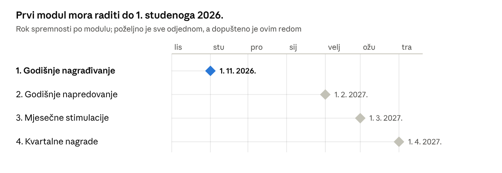
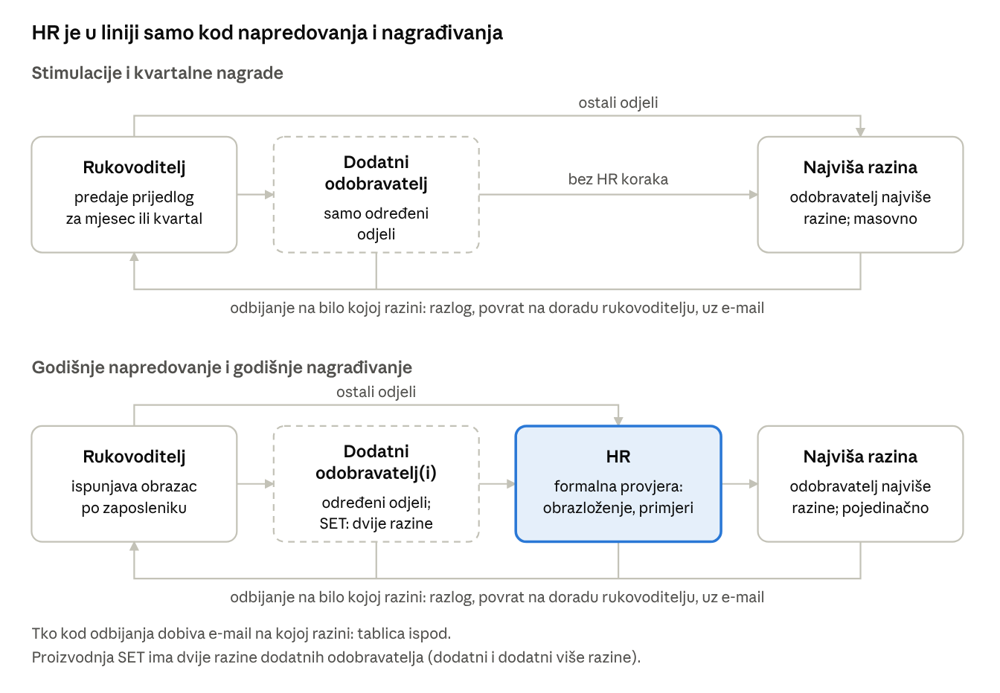
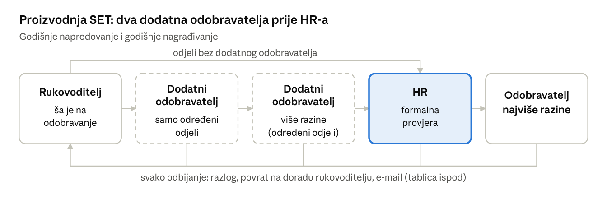

# Specifikacija – D&ST Grow & Reward

Oct 1, 2026 · @Matej Hanzlić

## Uvod

KONČAR D&ST želi jednu web aplikaciju u kojoj će voditi četiri HR procesa: mjesečne stimulacije, kvartalne nagrade, godišnje napredovanje i godišnje nagrađivanje. Danas se ti procesi vode u odvojenim, djelomičnim aplikacijama i Word obrascima; nova aplikacija ih objedinjuje, a prvi modul mora raditi do Nov 1, 2026.

**Zašto:** jedinstven, kontroliran i transparentan postupak – standardiziran unos, izračun, odobravanje, izvještavanje i razmjena podataka, s budžetskim kontrolama i tragom svake izmjene.

**Za koga:** aplikaciju koristi oko 80 rukovoditelja, HR administratori, direktori, članovi Uprave i predsjednik Uprave; u najvećem opterećenju radi oko 40 ljudi istovremeno. Svi moduli odnose se isključivo na zaposlenike izvršitelje – rukovoditelji, direktori i članovi Uprave u aplikaciji su samo korisnici koji predlažu i odobravaju, ne primaju nagrade kroz nju.

**Kako radi, u jednoj rečenici:** HR otvori razdoblje i unese budžet, rukovoditelj za svoje ljude unese prijedlog, prijedlog putuje kroz liniju odobravanja, a odobreni iznosi izvoze se za obračun plaća (HRNET).

**Osnovna pravila koja vrijede svuda:**

- Svi iznosi su bruto, u eurima.
- Vlasnik aplikacije i svih procesa je HR.
- Postoje dva odvojena okruženja: testno i produkcijsko.
- Sustav sam računa iznose i provjerava pravila; ako pravilo nije zadovoljeno (npr. prekoračen budžet ili nedostaje obrazloženje), prijedlog se ne može poslati.
- Svako razdoblje (mjesec, kvartal, ciklus) može se zaključati i otključati, a zaključeno razdoblje se naknadnim promjenama više ne mijenja.
- Svaka važna izmjena bilježi se: tko, kada i što je promijenio.

## Plan isporuke

Poželjno je da svi moduli budu gotovi, testirani i spremni u isto vrijeme; ako to nije izvedivo, isporučuju se ovim redom, a svaki mora biti spreman najkasnije do svog roka.



- Stimulacije i kvartalne nagrade mogu doći kasnije jer postojeće aplikacije za njih rade do 1. travnja 2027.
- Svaka faza ide u rad tek kad su gotovi testiranje, prijenos podataka, edukacija korisnika i produkcijsko okruženje.
- Plan svake faze uključuje analizu, dizajn, razvoj, prijenos podataka, testiranje, edukaciju, puštanje u rad i stabilizaciju.
- Konačan opseg potvrđuje se na radionicama analize prije ugovaranja; manje korekcije i dopune Naručitelj će javljati tijekom izrade.

Prvi modul ne može raditi bez temelja aplikacije (korisnici, uloge, zaposlenici, hijerarhija, linije odobravanja, obavijesti, trag izmjena), pa i temelj mora biti spreman do prvog roka.

## Tko radi u aplikaciji

Prijedlog unosi neposredno nadređeni rukovoditelj (član Uprave za svoje direktno podređene); direktori, članovi Uprave i HR ga provjeravaju i odobravaju, a HR još i vodi cijelu aplikaciju.

| Uloga | Što vidi | Što radi |
| --- | --- | --- |
| **Rukovoditelj** (oko 80) | svoje zaposlenike, njihove plaće, budžet i statuse svog odjela | unosi, sprema i šalje prijedloge za svoje ljude |
| **Dodatni odobravatelj** (samo određeni odjeli) | prijedloge odjela za koje je određen | odobrava ili odbija prije sljedeće razine; u proizvodnji SET postoje dvije takve razine |
| **Direktor** | sve odjele kojima je nadređen: prijedloge, statuse, iskorištenost budžeta, izvještaje, povijest | odobrava ili odbija; ne predlaže |
| **Član Uprave** | sve sektore i odjele kojima je nadređen, zbirno i po zaposleniku: statuse, budžete, prijedloge, odobrenja, izvještaje | odobrava ili odbija; može predložiti i za svoje direktno podređene |
| **Predsjednik Uprave** | sve zaposlenike i zbirni izvještaj za cijelu tvrtku | pregled |
| **HR administrator** | sve što treba za vođenje procesa, povijest svih izmjena, zbirni izvještaj za cijelu tvrtku | vodi korisnike, uloge, zaposlenike, cikluse, budžete, statuse, uvoz i izvoz, ispravke i zaključavanje razdoblja; u napredovanju i nagrađivanju provjerava prijedloge; kad redovni odobravatelj nije dostupan, može iznimno završno odobriti na temelju dogovora s nadležnima; pruža podršku korisnicima. U redovnom tijeku ne predlaže. |

**Tko što smije vidjeti:**

- Plaće, procjene, nagrade, napredovanja i disciplinske mjere vide se samo unutar vlastite nadležnosti i linije odobravanja.
- Disciplinsku mjeru unosi isključivo HR, ručno, za konkretnog zaposlenika i razdoblje; služi samo za primjenu pravila (npr. kvartalna nagrada = 0 EUR).
- Povijest izmjena vide samo HR administratori.
- Svaku administrativnu izmjenu HR-a sustav bilježi i ona ne šalje obavijesti drugim korisnicima, osim ako je za pojedini modul drugačije dogovoreno.

**Uloga prema poslu, ne prema osobi:** linija odobravanja nije ista za sve odjele. Kod nekih je prvi odobravatelj direktor, kod drugih član Uprave, a neki odjeli imaju još i dodatnog odobravatelja. Zato se za svakog rukovoditelja u aplikaciji posebno određuje tko mu odobrava (vidi „Temelj aplikacije“).

## Temelj aplikacije

Prije prvog modula aplikacija mora imati popis zaposlenika, organizacijsku strukturu, rukovoditelje s njihovim linijama odobravanja i HR postavke; to dijele svi moduli.

### Zaposlenici

Postoji jedan zajednički popis zaposlenika za sve module. Zaposlenik se prepoznaje po **OIB-u i SAP šifri** (DIST-ov broj iz matične knjige) i uz njih se vežu svi prijedlozi, obračuni, uvozi, izvozi i izvještaji. Isti OIB ne smije se pojaviti dvaput.

| Skupina | Podaci |
| --- | --- |
| Osobni | OIB, SAP šifra, ime, prezime, e-mail (ako treba za obavijesti) |
| Zaposlenje | datum dolaska, datum odlaska, status zaposlenja |
| Organizacija | organizacijska jedinica, sektor, odjel, neposredno nadređeni rukovoditelj, odobravatelj |
| Radno mjesto | radno mjesto, grupa radnih mjesta, pozicija (Pripravnik, Junior, Standardna pozicija, Senior), stupanj složenosti, platni razred |
| Plaća | bruto plaća |

- **Povijest:** svaka promjena ima datum od kad vrijedi i do kad, te tko ju je i kada unio. Važeći podatak koristi se za buduće obračune, raniji za izvještaje i rekonstrukciju prošlih razdoblja. Promjene nikad ne mijenjaju već zaključene cikluse.
- **Automatski u svim modulima:** promjena odjela, bruto plaće ili radnog mjesta odmah vrijedi u svim modulima – osim u već određenom budžetu stimulacija.
- **Promjena usred razdoblja:** ako zaposlenik promijeni odjel ili rukovoditelja, sustav ne dijeli iznose automatski; HR ručno određuje kamo pripada za to razdoblje.
- **Odlazak:** zaposlenik se deaktivira s datumom; ostaje vidljiv u povijesti i izvještajima, ali ne ulazi u nove obračune i prijedloge. Može se ponovno aktivirati.
- **Rukovoditelji, direktori i članovi Uprave** nisu u obračunu – vode se samo kao korisnici koji predlažu i odobravaju.

### Kako podaci ulaze

1. **Prvi prijenos** iz postojećih aplikacija za stimulacije i kvartalne nagrade.
2. **Dopuna** polja kojih danas nema (npr. pozicija, stupanj složenosti, platni razred, sektor, grupa radnih mjesta) – potrebna prije modula koji ih koriste (npr. stupanj složenosti za godišnju nagradu, pozicija i platni razred za napredovanje).
3. **Svakodnevno održavanje:** HR ručno unosi nove zaposlenike, odlaske, reaktivacije i promjene.
4. **Masovna promjena** (osobito plaća) standardiziranom Excel datotekom, s provjerom prije potvrde; vrijedi samo za buduće obračune.

### Rukovoditelji i linije odobravanja

- HR ručno održava rukovoditelje, odobravatelje i linije odobravanja prema stvarnoj hijerarhiji.
- Pregled po godini: rukovoditelj, organizacijska jedinica, broj zaposlenika, budžet stimulacija te prvi, drugi i, ako postoji, treći odobravatelj.
- Za određene odjele upisuje se dodatni odobravatelj; proizvodnja SET ima dvije razine dodatnih odobravatelja.

### Postavke koje vodi HR

- Otvaranje ciklusa i razdoblja, budžeti i poslovni parametri (postoci, iznosi, faktori, limiti, pravila) prema odlukama Uprave.
- Zaključavanje i otključavanje mjeseca, kvartala i ciklusa.
- Šifrarnici, korisnici, uloge, hijerarhija i odobravatelji.

### Trag izmjena

Za svaku važnu izmjenu bilježi se tko, kada i što je promijenio: prijedlozi, statusi, odobrenja i odbijanja s napomenama, HR intervencije, budžeti i preraspodjele, uvozi i ponovni uvozi, izvozi, zaključavanja te promjene podataka o zaposlenicima. Vodi se i popis svih uvoza, izvoza i poslanih obavijesti. Trag izmjena vide samo HR administratori.

### Obavijesti

Sve e-mail obavijesti i podsjetnici idu iz jednog mjesta. HR uređuje tekstove poruka i pravila slanja po modulu; primjeri okidača su otvaranje ciklusa, podsjetnik prije roka, slanje na odobrenje, odbijanje, vraćanje na doradu, zaključavanje razdoblja te uspješan ili neuspješan izvoz. Primatelji se određuju prema trenutnim ulogama, rukovoditeljima i odobravateljima, a sustav pamti što je poslano. Tko točno dobiva e-mail u postupku odobravanja opisano je u sljedećem poglavlju.

## Kako prijedlog putuje

Rukovoditelj pošalje prijedlog, prijedlog redom prolazi odobravatelje njegova odjela, a tko god ga odbije vraća ga rukovoditelju na doradu, uz razlog i e-mail.





### Pravila odobravanja

- **Redoslijed:** rukovoditelj → dodatni odobravatelj (samo određeni odjeli; u proizvodnji SET dvije razine) → HR (samo napredovanje i nagrađivanje) → odobravatelj najviše razine.
- **Tko je najviša razina:** određuje se po rukovoditelju, prema hijerarhiji. Kad je direktor u liniji, on je zadnji; kad je član Uprave druga razina, on je zadnji; u napredovanju je član Uprave uvijek zadnji.
- **HR u liniji:** kod napredovanja i nagrađivanja HR provjerava je li prijedlog potpun i u skladu s pravilnikom (obrazloženje, konkretni primjeri, iznos unutar raspona i budžeta) i može ga odbiti iz formalnih razloga.
- **Odbijanje:** razlog je obavezan, a prijedlog se vraća rukovoditelju na doradu. Odbija se pojedinačno, po zaposleniku – ostali prijedlozi istog rukovoditelja ostaju gdje jesu. Odbijeni prijedlog ne troši budžet. Rukovoditelj ga dorađuje i ponovno šalje: kod stimulacija odbijeni iznos može iskoristiti i za drugog zaposlenika u istom fondu; kod kvartalnih nagrada šalje ispravljeni prijedlog za istog zaposlenika u istom razdoblju; kod napredovanja novi ili izmijenjeni prijedlog u istom ciklusu, za istog ili drugog zaposlenika, i za drugu vrstu napredovanja ako su uvjeti ispunjeni i prijedlog je unutar budžeta.
- **Razlozi kod HR vraćanja** (bira se jedan ili više, uz obaveznu napomenu): nedovoljno obrazloženje, nedostaju konkretni primjeri, prijedlog nije u skladu s pravilnikom, iznos nije unutar dopuštenog raspona ili budžeta, nisu ispunjeni osnovni uvjeti, treba ispraviti osnovne podatke, ostalo (uz kratko pojašnjenje); kod godišnje nagrade i status zaposlenja. Dorađeni prijedlog ponovno ide HR-u na provjeru.
- **Masovno ili pojedinačno:** stimulacije i kvartalne nagrade mogu se odobriti odjednom za cijeli prikazani popis; napredovanje i godišnja nagrada odobravaju se pojedinačno.
- **Što odobravatelj vidi prije odluke:** kod stimulacija i kvartalnica popis po rukovoditelju i zaposleniku, iznose, statuse i napomene, a kod stimulacija i broj zaposlenika sa stimulacijom te potrošeni i ukupni budžet; kod napredovanja i nagrade cijeli obrazac, obrazloženja, predloženi iznos, HR napomene i povijest statusa.
- **Nakon zadnjeg odobrenja** prijedlog je zaključan za sve osim HR-a. HR ga mijenja samo na temelju dogovora ili odluke Uprave odnosno direktora (u napredovanju samo odlukom Uprave), a svaka izmjena ostaje u tragu izmjena.
- **Kad odobravatelj nije dostupan:** HR može iznimno završno odobriti, na temelju dogovora ili inputa nadležnih.

### Tko dobiva e-mail

O predanom i odobrenom prijedlogu e-mail dobivaju predlagatelj i odobravatelji u liniji. Kad netko odbije prijedlog i vrati ga na doradu, e-mail dobivaju:

| Tko odbija | Stimulacije i kvartalne nagrade | Napredovanje i nagrađivanje | Proizvodnja SET |
| --- | --- | --- | --- |
| Dodatni odobravatelj | rukovoditelj | rukovoditelj | rukovoditelj |
| Dodatni odobravatelj više razine | – | – | rukovoditelj i dodatni odobravatelj |
| HR | – | rukovoditelj i dodatni odobravatelj | rukovoditelj, dodatni i dodatni odobravatelj više razine |
| Odobravatelj najviše razine | rukovoditelj i dodatni odobravatelj | rukovoditelj i HR administratori | rukovoditelj, oba dodatna odobravatelja i HR administratori |

Kod godišnje nagrade sustav automatski obavještava rukovoditelja kad ocjene daju razinu učinka 1 ili 2, jer tada zaposlenik nema pravo na nagradu.

### Statusi prijedloga

| Status | Značenje |
| --- | --- |
| Spremljeno | rukovoditelj je spremio unos, ali ga još nije predao |
| Poslano na odobrenje | rukovoditelj je predao prijedlog; unos mu se zaključava i kreće odobravanje |
| Poslano HR-u | prijedlog napredovanja čeka HR provjeru |
| Vraćeno na doradu | prijedlog je vraćen rukovoditelju uz razlog |
| HR provjereno | HR je potvrdio prijedlog napredovanja i on ide dalje |
| Odbijeno | odobravatelj je odbio prijedlog uz napomenu |
| Odobreno | zadnje odobrenje; prijedlog je zaključan za sve osim HR-a |
| Zaključano | razdoblje ili ciklus je zatvoren za izmjene |
| Izvezeno za obračun | odobreni iznosi izvezeni su za obračun plaća |
| Primijenjeno u master podacima | nova plaća iz napredovanja upisana je s datumom primjene |

## Faza 1 – Godišnje nagrađivanje

Rok: Nov 1, 2026. Godišnja nagrada je jednokratna isplata za učinak iznad osnovnih očekivanja, jednom godišnje, neovisno o stimulacijama i kvartalnim nagradama; iznos je ugovorena mjesečna bruto plaća pomnožena faktorom razine učinka, uz gornji limit po stupnju složenosti radnog mjesta.

### Kako teče

1. **Uprava** odredi ukupan budžet, raspodijeli ga po profitnim centrima te organizacijskim jedinicama odnosno rukovoditeljima i odredi faktore za svaku razinu učinka.
2. **HR** unese budžete (isto pravilo za sve ili pojedinačne korekcije po sektoru, profitnom centru ili odjelu) i faktore, pokrene ciklus i odredi razdoblje u kojem rukovoditelji unose prijedloge.
3. **Rukovoditelj** za svakog zaposlenika kojeg predlaže ispuni obrazac. Za koga ne unese razinu, taj nije predložen – bez posebnog statusa i bez obaveznog razloga. Radnja Spremi čuva unos (vidi ga samo on), a Predaj na odobrenje zaključava unos i šalje ga dalje.
4. **Sustav** izračuna prosjek ocjena, razinu učinka, faktor i iznos, primijeni limite, provjeri raspoloživi budžet i upozori rukovoditelja ako bi ga prekoračio; takav prijedlog ne ide dalje, osim uz HR iznimku nakon odluke Uprave. Prijedlog bez obaveznih podataka ne može se predati.
5. **Odobravanje** ide pojedinačno kroz liniju: dodatni odobravatelj (ako ga odjel ima) → HR → odobravatelj najviše razine.
6. **Kalibracija:** nakon završnog odobrenja člana Uprave moguće su kalibracije između profitnih centara; korekcije unosi HR na temelju odluke Uprave.

### Obrazac za procjenu

Ispunjava se samo za zaposlenike predložene za nagradu i odnosi se na posljednjih 12 mjeseci. Zaglavlje se automatski puni podacima koji već postoje u aplikaciji: odjel, rukovoditelj, broj zaposlenih u odjelu, budžet za nagradu (iznos i %), datum procjene, ime i prezime, radno mjesto odnosno grupa radnih mjesta.

| Kriterij | Što znači | Dopuštene ocjene |
| --- | --- | --- |
| Kvaliteta rada | točnost, pouzdanost i dosljednost rezultata | 2, 3 ili 4 |
| Radna učinkovitost | organizacija rada, tempo i pravovremeno izvršenje uz zadržanu kvalitetu | 2, 3 ili 4 |
| Doprinos timu | dijeljenje znanja, suradnja i pozitivan utjecaj na rad i razvoj drugih | 3 ili 4 |

Za svaki kriterij rukovoditelj upisuje opisnu procjenu i 2–3 konkretna primjera iz prakse te obrazloženje prijedloga. Bez primjera prijedlog se ne može poslati. Obrazac na kraju prikazuje prosjek ocjena i prijedlog iznosa nagrade u EUR.

### Izračun

```latex
\text{nagrada} = \text{ugovorena mjesečna bruto plaća} \times \text{faktor razine učinka}
```

Faktore za svaki ciklus određuje Uprava, a HR ih unosi na početku ciklusa. Vrijednosti u tablici su primjer faktora.

| Razina učinka | Kombinacije ocjena (kvaliteta – učinkovitost – doprinos) | Prosjek | Faktor | Nagrada |
| --- | --- | --- | --- | --- |
| 1 | 2–2–3 | 2,33 | 0 | ne – sustav upozorava rukovoditelja |
| 2 | 2–2–4; 2–3–3; 3–2–3 | 2,67 | 0 | ne – sustav upozorava rukovoditelja |
| 3 | 2–3–4; 2–4–3; 3–2–4; 3–3–3; 4–2–3 | 3,00 | 0,6 | može |
| 4 | 2–4–4; 3–3–4; 3–4–3; 4–2–4; 4–3–3 | 3,33 | 0,9 | može |
| 5 | 3–4–4; 4–3–4; 4–4–3 | 3,67 | 1,7 | može |
| 6 | 4–4–4 | 4,00 | 2,8 | može |

| Stupanj složenosti | Najviši iznos nagrade (bruto) |
| --- | --- |
| I8 i I7 | 4.500 EUR |
| I6 | 6.000 EUR |
| I5 i I4 | 12.000 EUR |

- Nagrada je moguća od razine 3, uz obrazloženje konkretnim primjerima.
- 12.000 EUR je ujedno opći maksimum: vrijedi samo za I4 i I5, isključivo za izniman učinak, uz obrazloženje iznadprosječnog doprinosa i odobrenje kroz liniju.
- Limit se u pravilu ne prekoračuje. Iznimno, u posebno obrazloženim slučajevima, Uprava može odobriti viši iznos unutar budžeta; tada ga HR ručno unosi, a izmjena ostaje u tragu izmjena.
- HR može korigirati prijedlog ili iznos na temelju odluke Uprave ili upute direktora.
- Za svakog zaposlenika moraju postojati mjesečna bruto plaća i stupanj složenosti.

### Budžet i pregled

- Budžet se vodi po odjelu odnosno organizacijskoj jedinici, s prikazom dodijeljenog, rezerviranog (prijedlozi u postupku), iskorištenog i raspoloživog iznosa; stanje se ažurira pri svakom odobravanju i odbijanju.
- Preraspodjela unutar sektora ili odjela uz odobrenje nadležnog člana Uprave; između sektora samo odlukom Uprave. HR evidentira preraspodjelu.
- Član Uprave stalno vidi budžet svog profitnog centra i odjela, tko je koliko iskoristio i za koje zaposlenike, usporedbu jedinica i neiskorišteni budžet te prati preraspodjele.
- Direktor vidi budžet i prijedloge za sve svoje odjele te tko je koliko iskoristio.
- Iznimno, nakon odluke Uprave, HR može odobriti prekoračenje budžeta, bez posebne napomene; zapis o tome vidi samo HR.

### Izvještaji

- Nagrađeni zaposlenici: ime i prezime, OIB, SAP šifra, ugovorena mjesečna bruto plaća, stupanj složenosti, iznos nagrade.
- Raspodjela iznosa, iskorištenje budžeta, statusi i odobrenja po organizacijskim jedinicama, sektorima i profitnim centrima.
- Po odjelu: ukupan broj radnika (bez rukovoditelja), iznos nagrada, broj i postotak nagrađenih.
- Svi izvještaji izvoze se u Excel. Odobrene nagrade izvoze se i za obračun plaća (HRNET); oblik izvoza dogovara se u analizi.

## Faza 2 – Godišnje napredovanje

Rok: Feb 1, 2027. Napredovanje je povećanje bruto plaće koje vrijedi od 1. travnja; rukovoditelj predlaže iznos iz ponuđenih apoena i ispunjava obrazac, a nakon odobrenja HR potvrđuje upis nove plaće.

Postoje tri vrste napredovanja:

- **Horizontalno** – povećanje unutar istog platnog razreda;
- **Vertikalno, Junior → Standardna** – prelazak iz Početne (Junior) u Standardnu poziciju platnog razreda;
- **Vertikalno, Standardna → Napredna** – samo za ključna ekspertna radna mjesta.

### Kako teče

1. **Uprava** za ciklus odredi budžet i postotak; **HR** ih unese, potvrdi budžetska pravila, dopuštene iznose i ograničenja te otvori ciklus.
2. **Rukovoditelj** vidi sve aktivne zaposlenike iz svoje nadležnosti. Pripravnici i Juniori u prvih 12 mjeseci od zaposlenja prikazani su sivom bojom i ne mogu se predložiti.
3. Za odabranog zaposlenika rukovoditelj odabere vrstu napredovanja i iznos povećanja, ispuni odgovarajući obrazac i pošalje prijedlog.
4. Prijedlog ide pojedinačno kroz liniju: dodatni odobravatelj (ako ga odjel ima) → HR → član Uprave kao zadnja razina. HR provjerava potpunost i usklađenost s pravilnikom i po potrebi vraća prijedlog na doradu uz razlog.
5. Ako zaposlenik iz nekog razloga ne smije biti predložen, a rukovoditelj ga predloži, HR dodaje napomenu i razlog (neispunjen osnovni uvjet, status zaposlenja, neispunjeni uvjeti pravilnika, ograničenje budžeta, ostalo), a sustav onemogućuje slanje.
6. **Konačnu odluku donosi Uprava (je li to zadnja razina ili još zajednička odluka Uprave – pitanje 3)**; nakon nje ciklus se zaključava za sve osim HR-a.
7. Sustav izračuna novu bruto plaću (postojeća + odobreno povećanje). **HR** pregleda i potvrdi primjenu, a nova plaća upisuje se u podatke o zaposleniku s datumom primjene i izvozi za obračun plaća (HRNET). Automatski upis bez HR potvrde nije predviđen.
8. Nova plaća postaje osnova za stimulacije, kvartalne nagrade i daljnje napredovanje.

### Iznosi i budžet

- Povećanje je jedan od iznosa: 100, 150, 200, 250, 300, 350, 400 ili 450 EUR bruto; HR može definirati i druge iznose. Prijedlog mora biti unutar budžeta.
- Budžet se vodi na razini Društva, sektora i odjela. Prijedlog iznad odobrenog budžeta sustav blokira.
- Ako se u ciklusu primjenjuju ograničenja iz pravilnika: najviše 50 % zaposlenika na razini Društva odnosno sektora i najviše 75 % po odjelu, osim u odjelu s jednim zaposlenikom. HR pravilo uključuje i isključuje.
- Preraspodjela unutar sektora ili odjela uz odobrenje nadležnog člana Uprave, između sektora samo odlukom Uprave; HR je evidentira.
- Član Uprave stalno vidi dodijeljeni, iskorišteni, rezervirani i raspoloživi budžet svog profitnog centra i odjela, tko je iskoristio koji dio i za koje zaposlenike, usporedbu jedinica, neiskorišteni budžet i preraspodjele.

### Tri obrasca

Svi obrasci imaju isto zaglavlje: odjel, rukovoditelj, broj zaposlenih u odjelu, budžet za napredovanja (iznos i %), datum procjene, ime i prezime, radno mjesto odnosno grupa radnih mjesta, postojeća bruto plaća i datum njezine zadnje promjene te prijedlog povećanja (postotak, iznos povećanja i nova bruto plaća). Kod oba vertikalna napredovanja još i postojeći te predloženi viši platni razred.

|  | Horizontalno | Junior → Standardna | Standardna → Napredna |
| --- | --- | --- | --- |
| Kriteriji (ocjena 1–4) | samostalnost u radu, kvaliteta rada, radna učinkovitost; doprinos timu samo razine 3 i 4 | isti kao kod horizontalnog | stručna znanja, razina odgovornosti, samostalnost u stručnom odlučivanju, doprinos timu i prijenos znanja |
| Ocjene | najmanje 2 u svim kriterijima i barem jedna 3, nijedna 1 | najmanje 2 u svim kriterijima i barem jedna 3, nijedna 1 | najmanje dvije ocjene 3 i dvije ocjene 4 |
| Ostali uvjeti (svi DA) | stabilno visok učinak 12 mjeseci; kontinuirano preuzima zadatke i odgovornosti uz značajan angažman; sigurnost i radna disciplina bez propusta; ponašanje u skladu s vrijednostima; unutar budžeta odjela | 12–24 mjeseca u Početnoj poziciji (bez probnog roka i pripravništva); 12–24 mjeseca iznadprosječan učinak i preuzima odgovornosti višeg razreda; doprinos značajno nadmašuje očekivanja pozicije; sigurnost; ponašanje; unutar budžeta | radno mjesto je ključno ekspertno; 12 mjeseci iznadprosječan učinak; preuzima odgovornosti višeg razreda i doprinos značajno nadmašuje očekivanja; sigurnost; ponašanje; unutar budžeta |
| Eliminacija | sigurnost i radna disciplina: Zadovoljava / Ne zadovoljava; „Ne“ zaustavlja napredovanje | isto | sigurnost i disciplina su jedan od DA/NE uvjeta |
| Zaključak rukovoditelja | preporuka i prijedlog postotka odnosno iznosa | preporuka i prijedlog postotka odnosno iznosa | prijedlog prelaska u Naprednu poziciju |
| Suglasnosti | direktor sektora, HR | direktor sektora, HR | direktor sektora, HR, Uprava |

- Za svaki kriterij rukovoditelj upisuje opisnu procjenu, ocjenu i 2–3 konkretna, mjerljiva primjera iz prakse. Obrasci za svaki kriterij opisuju što znači koja razina.
- Ako je bilo koji uvjet NE, postupak se zaustavlja i prijedlog se ne može poslati. Isto vrijedi ako nedostaje bilo koji obavezni podatak, ocjena, opis, primjer ili prijedlog povećanja.
- **Ključna ekspertna radna mjesta:** Projektant transformatora SET, Projektant transformatora DT/ST, Razvojni inženjer, Voditelj prodajnog područja SET, Voditelj prodajnog područja DT, Konstruktor transformatora SET, Konstruktor transformatora DT/ST, Inženjer ispitivač transformatora SET, Inženjer procesa u Razvoju proizvodnje, Inženjer procesa u odjelu Projekt tehnologije, Specijalist za metalne konstrukcije SET, Specijalist za metalne konstrukcije DT/ST. HR može dodati i druga.
- **Prefiks Senior:** nakon odobrenja Uprave zaposlenik je najmanje 12 mjeseci u potkategoriji 3 ili 4 Standardne pozicije; ako zadrži uspješnost bez negativnih promjena, prelazi u viši (napredni) platni razred i naziv radnog mjesta dobiva prefiks Senior. Aplikacija mora podržati to pravilo.
- Točna obavezna polja, dopuštene vrijednosti, poruke greške i kontrole budžeta potvrđuju se zajedno s HR-om u analizi.

### Izvještaj napredovanja (po odjelu, izvoz u Excel)

Ukupan broj radnika (bez rukovoditelja), postotak povećanja broja zaposlenika u zadnjih godinu dana, prijedlog budžeta odjela u EUR (postotak od sume plaća odjela), broj i postotak promoviranih, prijedlog bruto iznosa napredovanja po odjelu (zbroj povećanja) u EUR i postotku, zbroj bruto plaća prije i nakon povećanja.

## Faza 3 – Mjesečne stimulacije

Rok: Mar 1, 2027. Stimulacija je mjesečni dodatak od 0 do 20 % mjesečne bruto plaće koji rukovoditelj dodjeljuje svojim ljudima, a troši se iz godišnjeg fonda odjela.

### Budžet

- Jedan godišnji fond po odjelu, od 1. travnja do 31. ožujka sljedeće godine. Visinu određuje Uprava kao postotak ukupnog mjesečnog fonda plaća; HR je ručno unosi na početku razdoblja i u pravilu se ne mijenja tijekom godine.
- Neiskorišteni dio ne prenosi se u sljedeće razdoblje.
- Iznimna korekcija moguća je kad zaposleniku prestane pripravnički status: od mjeseca promjene do kraja razdoblja, razmjerno, po 2,5 % njegove mjesečne bruto plaće.
- Nema mjesečnog limita: u jednom mjesecu smije se dati i više, sve dok ukupno ostaje unutar preostalog godišnjeg fonda i prolazi redovnu liniju odobravanja. Dodjelu koja bi premašila fond sustav blokira i jasno javlja razlog.

### Kako teče

1. Rukovoditelj otvori svoj odjel, godinu i mjesec. Vidi zaposlenike, njihove bruto plaće te godišnji, iskorišteni i preostali budžet odjela.
2. Za svakog zaposlenika iz izbornika odabere 0, 5, 10, 15 ili 20 %. Sustav sam izračuna iznos, zbroj stimulacija i novo stanje budžeta.
3. Za svaku stimulaciju veću od 0 % upiše obrazloženje.
4. Radnjom **Predaj na odobrenje** šalje cijeli mjesečni prijedlog odjela odjednom; pojedinačnog slanja nema. Unos mu se zaključava.
5. Odobravatelj (dodatni, ako ga odjel ima, pa najviša razina) može odobriti cijeli prikazani popis odjednom. Odbija pojedinačno, uz napomenu: odbijeni zaposlenik vraća se rukovoditelju, a ostali ostaju odobreni. Odbijeni iznos ne troši fond i može se iskoristiti za drugog zaposlenika.
6. Rok za unos i završetak odobravanja je zadnji dan mjeseca za koji se isplata odnosi.
7. Odobreni iznosi izvoze se za obračun plaća.

- Član Uprave može dodijeliti stimulaciju zaposlenicima u svojoj nadležnosti.
- Ako u mjesecu nema stimulacija, nema ni obračuna ni umanjenja budžeta.

### Ekran za unos

Po zaposleniku najmanje: osnovni podaci, datum dolaska i odlaska, bruto plaća, odabrani postotak, izračunati bruto iznos, napomena rukovoditelja, napomena odobravatelja, status te tko je i kada mijenjao i odobrio.

### Izvoz i izvještaji

- **Izvoz za HRNET** (standardizirana datoteka za odabrani mjesec): OIB, SAP šifra, prezime, ime, bruto iznos stimulacije, dodijeljeni postotak, OIB nadređenog.
- **Izvještaj** po odobravatelju, rukovoditelju, zaposleniku, godini i mjesecu: postotak, bruto iznos, status, napomene i podaci o odobrenju.

## Faza 4 – Kvartalne nagrade

Rok: Apr 1, 2027. Kvartalna nagrada računa se sama iz bruto plaće, postotka koji odredi Uprava, procjene rukovoditelja i prisutnosti na poslu; rukovoditelj samo ocjenjuje četiri kriterija, a disciplinska mjera u kvartalu ukida nagradu.

### Kako teče

1. **Uprava** za svaki kvartal odredi postotak bruto plaće koji je najviša osnovica nagrade, jednak za sve zaposlenike. HR ga unosi; rukovoditelji ga ne mogu mijenjati.
2. **HR uvozi prisutnost:** odabere godinu i kvartal i učita CSV datoteku s OIB-om, SAP šifrom, prezimenom i imenom, prisutnošću i fondom sati. Sustav za svaki redak prikaže OIB, SAP šifru, ime i prezime iz baze i iz datoteke, prisutnost, fond sati i status (ok, korisnik ne postoji u bazi, korisnik ne postoji u CSV-u), a retke s greškom jasno označi. Do zaključavanja kvartala HR može učitati novu datoteku ako je prethodna bila nepotpuna ili pogrešna; svaki uvoz se bilježi.
3. **HR unosi disciplinsku mjeru** (upozorenje na obveze iz radnog odnosa) za konkretnog zaposlenika i kvartal.
4. **Rukovoditelj** vidi sve svoje zaposlenike s izračunatim iznosima. Svi kriteriji su zadano na 100 %; on ih može spustiti na 75, 50, 25 ili 0 %, a ako spusti bilo koji, upisuje obrazloženje. Iznos ne unosi i ne može ga mijenjati. Spremi čuva unos (vidi ga samo on), Predaj na odobrenje zaključava unos.
5. **Odobravanje:** dodatni odobravatelj (ako ga odjel ima), pa najviša razina; cijeli prikazani popis može se odobriti odjednom, a odbija se pojedinačno uz napomenu – odbijeni zaposlenik vraća se rukovoditelju, ostali ostaju odobreni.
6. **Rok** za unos i odobravanje je do sredine mjeseca nakon isteka kvartala.
7. Odobreni iznosi izvoze se za obračun plaća.

Član Uprave može dodijeliti kvartalnu nagradu zaposlenicima u svojoj nadležnosti.

### Izračun

```latex
\text{nagrada} = \text{bruto plaća} \times \text{\% Uprave} \times (0{,}40\,K + 0{,}30\,Q + 0{,}15\,U + 0{,}15\,S) \times \text{prisutnost}
```

K = kvaliteta posla (40 %), Q = količina posla (30 %), U = urednost radnog mjesta i pridržavanje internih pravila (15 %), S = suradnja s radnicima i nadređenima (15 %).

- Redoslijed: najviši iznos (plaća × % Uprave) → procjena rukovoditelja → prisutnost → disciplinska mjera.
- Kriterij ocijenjen s 0 % umanjuje samo svoj dio procjene; cijela nagrada je 0 EUR samo ako to proizađe iz izračuna (npr. prisutnost 0 %) ili zbog disciplinske mjere.
- Disciplinska mjera ili upozorenje u kvartalu = nagrada 0 EUR, bez obzira na sve ostalo.

| Prisutnost / fond sati (na 2 decimale) | Primijenjeni postotak |
| --- | --- |
| do i uključujući 30,00 % | 0 % |
| više od 30,00 % do i uključujući 50,00 % | 50 % |
| više od 50,00 % do i uključujući 75,00 % | 75 % |
| više od 75,00 % | 100 % |

| Primjer | Ulaz | Nagrada |
| --- | --- | --- |
| 1 | plaća 2.000 EUR, Uprava 75 %, svi kriteriji 100 %, prisutnost 100 % | 1.500,00 EUR |
| 2 | kao 1, količina 75 % → procjena 92,5 % | 1.387,50 EUR |
| 3 | kao 1, urednost 0 % → procjena 85 % | 1.275,00 EUR |
| 4 | kao 2, prisutnost 75 % (odnosno 0 %) | 1.040,63 EUR (odnosno 0 EUR) |
| 5 | disciplinska mjera u kvartalu | 0 EUR |

### Ekran za unos

Po zaposleniku najmanje: osnovni podaci, OIB, SAP šifra, bruto plaća, postotak Uprave, prisutnost, fond sati, izračunati postotak prisutnosti, četiri kriterija, ukupna procjena, najviši iznos prije procjene, iznos nakon procjene, konačni bruto iznos, status disciplinske mjere, napomene, status te tko je i kada mijenjao i odobrio. Za svaki kriterij vidi se odabrana vrijednost, njegov ponder i doprinos ukupnoj procjeni, tako da je jasno kako odabir utječe na iznos. Izračunata polja su zaključana.

### Izvoz i izvještaji

- **Izvoz za HRNET:** OIB, SAP šifra, prezime, ime, bruto plaća za obračun, konačni postotak, konačni bruto iznos nagrade, OIB nadređenog.
- **Izvještaj** po odobravatelju, rukovoditelju, zaposleniku, godini i kvartalu: bruto plaća, prisutnost, procjena, disciplinska mjera, iznos prije prisutnosti, konačni iznos, status, napomene i podaci o odobrenju; izvoz u Excel.

## Zajedničko svim modulima

Budžeti, izvještaji, uvoz i izvoz rade isto u svim modulima; razlike po modulu opisane su u fazama.

### Budžeti

Gdje modul ima budžet, prikazuju se dodijeljeni, rezervirani (prijedlozi u postupku), iskorišteni i raspoloživi iznos. Stanje se ažurira automatski pri svakom odobravanju i odbijanju, a iznimke (preraspodjele, prekoračenja) moguće su samo kontrolirano i uz trag izmjena.

### Izvještaji i pregledi

- Pregledi budžeta, realizacije, statusa i rezultata za svaki modul.
- Presjeci po odjelu, sektoru, rukovoditelju, odobravatelju, zaposleniku, razdoblju, statusu i iskorištenosti budžeta, uz povijest nagrađivanja i napredovanja.
- Za Upravu zbirno po sektorima, profitnim centrima i organizacijskim jedinicama.
- Svatko vidi samo izvještaje unutar svoje uloge i nadležnosti; zbirni izvještaj za cijelu tvrtku, u svim modulima, imaju HR i predsjednik Uprave.
- Izvještaji koriste organizacijsku pripadnost i povijest koju održava HR; iznosi se ne dijele automatski između odjela, iznimke HR uređuje ručno.
- Svi izvještaji izvoze se u Excel (i CSV).

### Uvoz i izvoz

| Tok | Kako |
| --- | --- |
| Prvi prijenos | podaci iz postojećih aplikacija za stimulacije i kvartalne nagrade |
| Podaci o zaposlenicima | standardizirana Excel datoteka s provjerom; primjena samo na buduća razdoblja |
| Prisutnost | CSV po godini i kvartalu, s provjerom i statusom svakog retka |
| Obračun plaća (HRNET) | standardizirana datoteka po modulu; točan format, obavezni stupci, provjere i poruke greške potvrđuju se u analizi; nakon izvoza prijedlog dobiva status „Izvezeno za obračun“ |
| Izvještaji | Excel izvozi za operativne i upravljačke potrebe |

## Sigurnost i kvaliteta rada

Aplikacija obrađuje osobne podatke, plaće, procjene, prijedloge napredovanja, nagrade i disciplinske mjere, pa pristup mora biti strogo ograničen i svaki korak zabilježen.

- **Pristup:** prava se uvijek određuju kombinacijom uloge, organizacijske nadležnosti i linije odobravanja. Bruto plaće vide samo HR administratori te rukovoditelji, direktori i članovi Uprave unutar svoje nadležnosti.
- **Trag:** trag izmjena, povijest podataka, zapisi uvoza i izvoza te evidencija poslanih obavijesti.
- **Okruženja:** obavezno odvojeno testno i produkcijsko okruženje.
- **Potrebno riješiti i opisati:** prijavu i upravljanje identitetima, enkripciju, logiranje, sigurnosne kopije, oporavak i rok čuvanja podataka.
- **Opterećenje:** aplikacija mora pouzdano raditi s oko 40 istovremenih korisnika; treba navesti performanse i način skaliranja.
- **Uporabljivost:** responzivno sučelje, jednostavno za korištenje i pristupačno; izračunata polja jasno su označena i zaključana za ručni unos.
- **Odgovornosti:** treba jasno navesti sigurnosne pretpostavke, infrastrukturne preduvjete, tko je za što odgovoran, razinu podrške (SLA) i sva odstupanja od zahtjeva.

## Završetak: testiranje, prihvaćanje i puštanje u rad

Svaki modul prije produkcije prolazi korisničko testiranje u testnom okruženju, a prihvaća se tek kad su izračuni, tokovi, prava i izvozi potvrđeni.

### Što se testira u svakom modulu

Unos podataka, provjere, tok odobravanja, zaključavanje razdoblja, izvještaji, uvoz i izvoz te pristup prema ulogama.

### Što se posebno testira

| Modul | Posebno provjeriti |
| --- | --- |
| Godišnje nagrađivanje | automatsko punjenje podataka u obrazac; unos budžeta u iznosu i postotku; ocjene 2–4 po kriterijima; opisne procjene; obavezna 2–3 primjera; prosjek ocjena i pretvaranje razine u faktor; izračun iznosa u EUR; blokada slanja kad nešto nedostaje; blokada prekoračenja budžeta; odobravanje (i masovno, ako se uključi) i pojedinačno odbijanje; zaključavanje nakon predaje i nakon zadnjeg odobrenja |
| Godišnje napredovanje | unos budžeta i postotka za ciklus; pravilo 3 % ako ga odredi Uprava; kontrola budžeta na razini Društva, sektora i odjela; ograničenja 50 % i 75 %; iznosi 100–450 EUR; sve tri vrste napredovanja; DA/NE provjere; eliminacija zbog sigurnosti i discipline; obavezne procjene, ocjene 1–4 i 2–3 primjera; HR vraćanje na doradu; pojedinačno odobravanje i odbijanje; izračun nove plaće; primjena od 1. 4.; upis nove plaće nakon HR potvrde |
| Mjesečne stimulacije | opći testovi iz prethodnog odlomka |
| Kvartalne nagrade | uvoz prisutnosti s ispravnim i neispravnim OIB-om; pragovi 0, 50, 75 i 100 %; zadane vrijednosti 100 %; smanjenje jednog ili više kriterija; obavezno obrazloženje ispod 100 %; kriterij s 0 %; disciplinska mjera; zaključana izračunata polja; masovno odobravanje; pojedinačno odbijanje; izvoz odobrenih iznosa |

### Kad je modul prihvaćen

1. Korisničko testiranje u testnom okruženju je uspješno.
2. Potvrđeni su izračuni, provjere, tokovi odobravanja, prava pristupa i zaključavanje razdoblja.
3. Uvoz, ponovni uvoz, obrada grešaka i izvoz rade.
4. Potvrđeni su izvještaji, Excel izvozi i trag izmjena.
5. Isporučeni su dokumentacija, edukacija i dogovorena podrška nakon puštanja.

### Puštanje u rad

Svaki modul ide u rad usklađeno s testiranjem, prijenosom podataka, edukacijom korisnika i spremnim produkcijskim okruženjem, a nakon puštanja slijedi razdoblje stabilizacije.

## Što još treba dogovoriti s Naručiteljem

Otvoreno je još 31 pitanje. Uz većinu je navedeno kako radimo dok se ne dogovori drugačije; pitanja 11–13 utječu na izračun godišnje nagrade, pa ih treba riješiti prije prvog roka.

### Odobravanje

1. **Odbijanje kod stimulacija i kvartalnica:** vraća li se na doradu samo odbijeni zaposlenik ili cijeli prijedlog odjela? *Radimo:* samo odbijeni zaposlenik, ostali ostaju odobreni.
2. **Nakon dorade:** prolazi li prijedlog ponovno cijelu liniju ili nastavlja od razine koja ga je odbila? *Radimo:* ponovno cijelu liniju.
3. **Najviša razina:** tko je odobravatelj najviše razine za svaki odjel i modul? Kod napredovanja – postoji li nakon člana Uprave još zajednička odluka Uprave? *Radimo:* određuje se po rukovoditelju; u napredovanju je zadnji član Uprave.
4. **Dodatni odobravatelji:** koji odjeli osim proizvodnje SET imaju dodatnog odobravatelja i tko su? *Radimo:* HR ih upisuje po odjelu.
5. **E-mail kod odbijanja:** kad najviša razina odbije napredovanje ili nagradu, dodatni odobravatelj ne dobiva e-mail, a u proizvodnji SET dobiva. Je li to namjerno? *Radimo:* kako je opisano u tablici obavijesti.
6. **Masovno odobravanje godišnje nagrade:** smije li se? *Radimo:* pojedinačno, s mogućnošću da se masovno uključi.
7. **Član Uprave kao predlagatelj:** za koje izvršitelje smije predlagati i tko odobrava njegov prijedlog?
8. **Potpisi na obrascima:** obrasci predviđaju potpis direktora sektora, a neke linije nemaju direktora. *Radimo:* odobrenja u aplikaciji zamjenjuju potpise.
9. **HR izmjene nakon odobrenja:** vrijedi li jedno pravilo za sve module (dogovor, odluka Uprave ili uputa direktora), ili kod napredovanja samo odluka Uprave? *Radimo:* kod napredovanja samo odluka Uprave, inače dogovor ili odluka nadležnih.
10. **Status kod dodatnog odobravatelja:** koji status prijedlog ima dok čeka dodatnog odobravatelja?

### Godišnje nagrađivanje

11. **Prekoračenje budžeta:** samo upozorenje ili blokada? *Radimo:* blokada, uz HR iznimku nakon odluke Uprave.
12. **Ocjene:** obrazac opisuje razine 1–4, a pravilo dopušta 2–4 (doprinos timu 3–4). *Radimo:* 2–4 odnosno 3–4.
13. **Limit za I4 i I5:** koji limit vrijedi bez iznimnog učinka, što je „izniman učinak“ i što točno znači „dopušteni raspon nagrade“?
14. **Razina nagrade:** razinu računa sustav iz ocjena – treba li rukovoditelj uz to još posebno birati „razinu nagrade“? *Radimo:* ne, razina se računa.

### Godišnje napredovanje

15. **Pravilo 3 %:** što točno znači? *Radimo:* parametar ciklusa koji HR unosi prema odluci Uprave.
16. **Junior → Standardna:** granica je 12–24 mjeseca u Početnoj poziciji – tko određuje točan broj? *Radimo:* HR po ciklusu.
17. **Blokada 12 mjeseci:** računa li se od datuma zaposlenja ili od dolaska na poziciju Pripravnik odnosno Junior? *Radimo:* od datuma zaposlenja.
18. **Budžet odjela:** obrasci provjeravaju budžet odjela, a budžet se po odjelu vodi „po potrebi“. *Radimo:* uvijek i po odjelu.
19. **Postotak povećanja:** povećanja su iznosi u EUR, a obrasci traže i postotak. *Radimo:* sustav računa postotak iz iznosa.
20. **Standardna → Napredna:** je li uvjet točno dvije ocjene 3 i dvije 4 ili barem toliko (prolaze li 3-4-4-4 i 4-4-4-4)? *Radimo:* barem toliko.
21. **Doprinos timu:** je li obavezan kriterij i vrijedi li ocjena 4 umjesto tražene „jedne razine 3“?
22. **Eliminacija kod Standardna → Napredna:** treba li i tu poseban eliminacijski kriterij? *Radimo:* ne, sigurnost i disciplina su među DA/NE uvjetima.
23. **Pozicije:** popis pozicija (Pripravnik, Junior, Standardna, Senior) i Početna i Napredna pozicija – kako ih uskladiti? Za pravilo Senior trebaju i potkategorija 3 ili 4 te datum odobrenja Uprave.
24. **Naziv obrasca:** „Standardna → Napredna“ ili „Standardna → Senior“? *Radimo:* Napredna; Senior je naziv nakon 12 mjeseci.
25. **Izvoz napredovanja:** dodati i status „Izvezeno za obračun“? *Radimo:* da.

### Stimulacije i kvartalne nagrade

26. **Obrazloženje stimulacije:** za svakog zaposlenika ili samo za stimulaciju iznad 0 %? *Radimo:* samo iznad 0 %.
27. **Disciplinska mjera:** unosi li je samo HR ili i rukovoditelj u kvartalnicama? *Radimo:* samo HR.
28. **Neispravan OIB pri uvozu prisutnosti:** kako ga prikazati, uz statuse „ok“ i „ne postoji“? *Radimo:* kao grešku retka.
29. **Format izvoza:** Excel ili CSV za HRNET, kako izgleda izvoz godišnje nagrade za obračun i treba li zadržati današnji poseban izvoz za Upravu? *Radimo:* oba formata.

### Podaci

30. **Novi podaci o zaposlenicima:** odakle se prvi put unose pozicija, stupanj složenosti, platni razred, sektor i ostala nova polja? *Radimo:* HR dostavlja Excel.
31. **Čuvanje podataka:** koliko dugo se čuvaju podaci i trag izmjena, i vrijedi li isto za zaposlenike koji su otišli?
